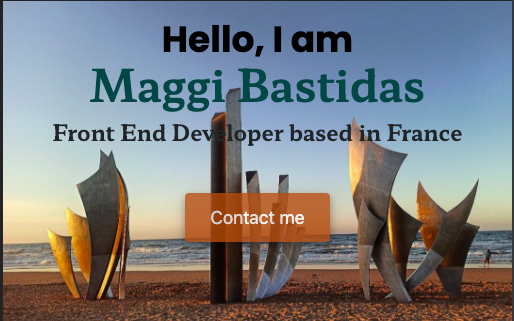

# Building a Portfolio

  

## Geneal information
-This project is built in VS code.

-The programing languages used are HTML and CSS.

-The code is open source and hosted by Netlify.

-The fonts are obtained at: `https:/fonts.googleapis.com`

-The icons are obtained at: `https://kit.fontawesome.com`

## Site description
The site is divide in 4 pages: 
1. Home Page: general information about coder and projects.
2. About: resume fo coder backgroung.
3. Projects: description of how the site was conceived and buttons linked to the site web and the code
4. Skills: technologies the coder used and cettificates obtanied. 

* At the buttom of each page, the coder info (E-mail, Linkedin, Github, Instagram) can be find.

